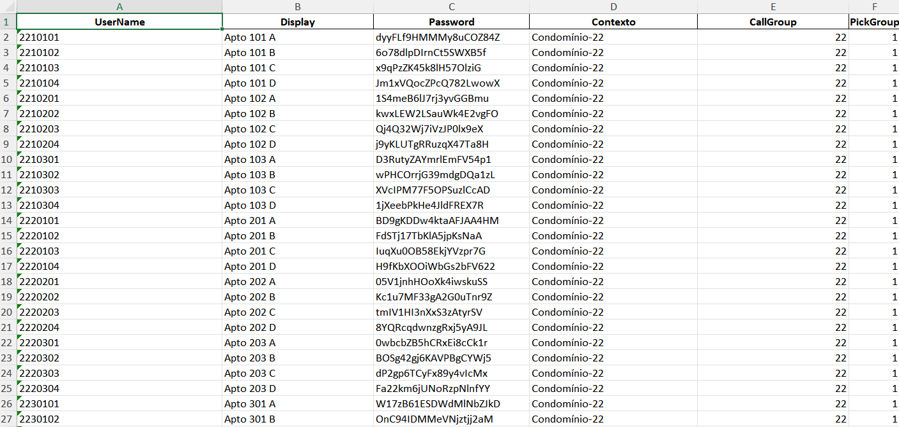

# 📞 Gerador de Ramais, Planilha e QR Codes para Condomínios

Este projeto automatiza a criação de:

- Arquivo `pjsip_additional.txt` com configurações de ramais;
- Planilha Excel contendo ramais, displays, senhas e informações do condomínio;
- QR Codes personalizados com logo e texto para cada ramal.

O objetivo é facilitar a configuração em massa de ramais SIP para centrais VoIP, especialmente em aplicações que usam Asterisk e Issabel 4
---

## 🚀 Funcionalidades

### ✔️ Geração do arquivo de ramais (`pjsip_additional.txt`)
O script:
- Recebe contexto, servidor, faixas de apartamentos e andares;
- Gera ramais automaticamente;
- Cria senhas fortes com `secrets`;
- Gera o arquivo pronto para uso no Asterisk.

### ✔️ Geração da Planilha Excel
Gera `planilha.xlsx` contendo:
- UserName  
- Display  
- Password  
- Contexto  
- CallGroup  
- PickGroup  

### ✔️ Geração de QR Codes Personalizados
Cada QR Code contém:
- Dados de SIP (username, password, subdomain);
- Logo centralizada;
- Texto com o número do apartamento;
- Salvo em `/output/qrCodes/`.

---

## 📦 Requisitos

O projeto utiliza os seguintes pacotes Python:

- pandas
- qrcode
- Pillow

```bash
pip install -r requirements.txt
```

ou 

```bash
python -m pip install -r requirements.txt
```
---

## ▶️ Como Executar

1. Instale as dependências ultilizando o comando apresentado na seção anterior 
2. Execute o projeto ultilizando

```bash
python main.py
```
Certifique-se de estar na parsta src para executar o comando acima

3. Durante a execução , informe:

- Servidor (pickup_group)

- Contexto do condomínio

- Andares

- Faixas de apartamentos (ex.: 101-118)

- Subdomain para os QR Codes (opcional)

- Se deseja gerar a planilha

 - Se deseja gerar os QR Codes

4. Os arquivos serão gerados automaticamente em:

- /output/pjsip_additional.txt
- /output/planilha.xlsx
- /output/qrCodes/*.png

## 🖼️ Exemplos de Saída
### 📄 Planilha

Gerada automaticamente com todas informações dos ramais.


## 🧾 pjsip_additional.txt

Arquivo completo e configurado para importação no Asterisk.

## 🖼️ QR Codes

Imagem com:

- QR Code

- Logo central

- Nome do apartamento em texto abaixo


---
## ⚠️ Observações Importantes

A pasta /output/ deve existir antes de rodar o projeto.

O arquivo .gitignore já ignora arquivos sensíveis como .txt, .xlsx e QR Codes.

Se quiser versionar apenas alguns arquivos, ajuste o .gitignore.
